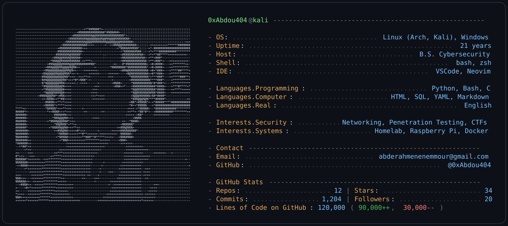

<!-- ============================================================================ Neofetch-style GitHub profile README (Andrew6rant style) ---------------------------------------------------------------------------- This file goes in the special repo named exactly after your username (e.g. github.com/<username>/<username>). See SETUP.md for step-by-step. The whole card is a pre-rendered SVG. GitHub automatically shows the dark or light version based on the viewer's theme, via the <picture> tag below. To change the text/colors: edit config.json and re-run python3 generate.py (or just ask Claude to regenerate it for you). ============================================================================ --> 
 <picture> <source media="(prefers-color-scheme: dark)" srcset="./assets/dark_mode.svg"> <source media="(prefers-color-scheme: light)" srcset="./assets/light_mode.svg">  </picture> 

